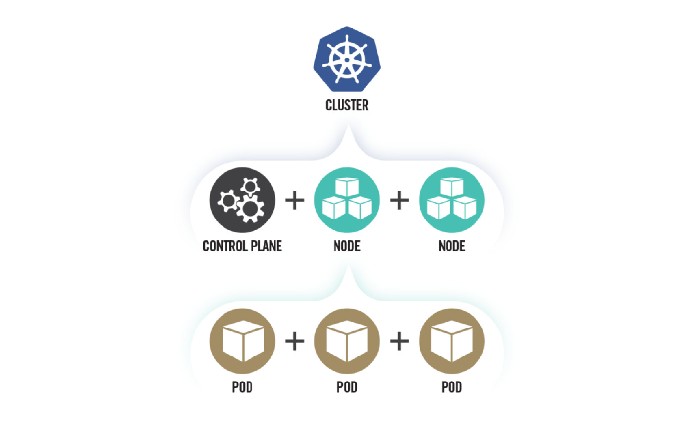

# Introduction

Kubernetes, often abbreviated as "K8s", is an open source container or orchestration system for automating the deployment, scaling and management of containerized applications. It manages all the elements that make up a cluster, from each microservice in the application to the entire cluster. Using containerized applications as microservices can provide more flexibility and security benefits than a monolithic software platform, but it can also introduce other complications.

This guide focuses on security challenges and, where possible, proposes hardening strategies for administrators of national security systems and critical infrastructure. Although this guidance is targeted at national security systems and critical infrastructure organizations, administrators of federal and state, local, tribal, and territorial (SLTT) government networks are also encouraged to implement the recommendations provided. Security issues with Kubernetes clusters can be complex and are often abused in potential threats that exploit their misconfiguration. The following guides provide specific security configurations to help build more secure Kubernetes clusters.

## suggestion

A summary of the main recommendations for each section is as follows:

- Kubernetes Pod security
   - Use the built container to run the application as a non-root user
   - Where possible, run containers with immutable file systems
   - Scan container images for possible vulnerabilities or misconfigurations
   - Use Pod Security Policies to enforce a minimum level of security, including:
     - Prevent privileged containers
     - Deny container functions that are often exploited to break through, such as `hostPID`, `hostIPC`, `hostNetwork`, `allowedHostPath`, etc.
     - Deny containers that execute as root or allow elevation to root
     - Use security services such as SELinux®, AppArmor®, and seccomp to harden applications and prevent exploitation.
- Network isolation and hardening
   - Use firewalls and role-based access control (RBAC) to lock down access to control plane nodes
   - Further restrict access to Kubernetes etcd server
   - Configure control plane components to use Transport Layer Security (TLS) certificates for authentication and encrypted communication
   - Set network policies to isolate resources. Pods and services in different namespaces can still communicate with each other unless additional isolation is implemented, such as network policies
   - Place all credentials and sensitive information in Kubernetes Secrets, not configuration files. Encrypt Secrets using strong encryption methods
- Authentication and authorization
   - Disable anonymous login (enabled by default)
   - Use strong user authentication
   - Create RBAC policies to restrict administrator, user and service account activity
- Log audit
   - Enable audit logging (default is disabled)
   - Continuously save logs to ensure availability in the event of node, Pod or container level failure
   - Configure a metric logger
- Upgrade and apply security practices
   - Immediately apply security patches and updates
   - Conduct regular vulnerability scanning and penetration testing
   - Remove components from the environment when they are no longer needed

## Architecture Overview

Kubernetes uses a cluster architecture. A Kubernetes cluster is composed of some control planes and one or more physical or virtual machines, called worker nodes. Worker nodes host Pods, which contain one or more containers. A container is an executable image that contains a software package and all its dependencies. See Figure 2: Kubernetes architecture.

The control plane makes decisions about the cluster. This includes scheduling the running of containers, detecting/reacting to failures, and starting new Pods if the number of replicas specified in the deployment file is not met. The following logical components are part of the control plane:

- **Controller manager (default port: 10252)** - Monitors Kubernetes clusters to detect and maintain several aspects of the Kubernetes environment, including adding Pods to services, maintaining the correct number of Pods in a set, and responding to the loss of nodes React.
- **Cloud controller manager (default port: 10258)** - An optional component for cloud-based deployments. The cloud controller interfaces with the cloud service provider to manage the cluster's load balancer and virtual network.
- **Kubernetes API Server (default port: 6443 or 8080)** - The interface for administrators to operate Kubernetes. Therefore, API servers are often exposed outside the control plane. The API server is designed to be scalable and may exist on multiple control plane nodes.
- **Etcd (default port range: 2379-2380)** - A persistent backup store where all information about the cluster status is saved. Etcd should not be manipulated directly, but should be managed through the API server.
- **Scheduler (default port: 10251)** - Tracks the status of worker nodes and decides where to run pods. Kube-scheduler can only be accessed by nodes within the control plane.

Kubernetes worker nodes are physical or virtual machines dedicated to running containerized applications for the cluster. In addition to running the container engine, worker nodes host the following two services, allowing coordination from the control plane:

- **Kubelet (default port: 10250)** - Runs on each worker node to coordinate and verify the execution of Pods.
- **Kube-proxy** - A network proxy that uses the host's packet filtering capabilities to ensure correct routing of packets within a Kubernetes cluster.

Clusters are typically hosted using a cloud service provider's (CSP) Kubernetes service or hosted on-premises. When designing a Kubernetes environment, organizations should understand their responsibilities in maintaining the cluster securely. The CSP manages most Kubernetes services, but organizations may need to handle certain aspects such as authentication and authorization.