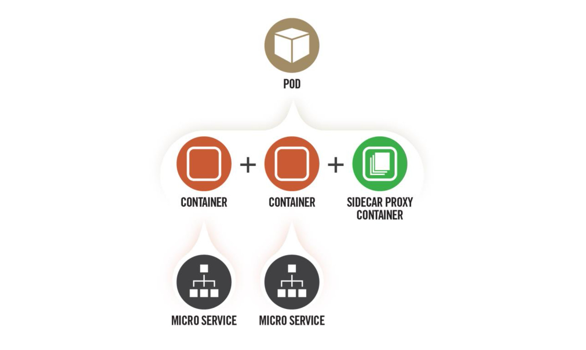
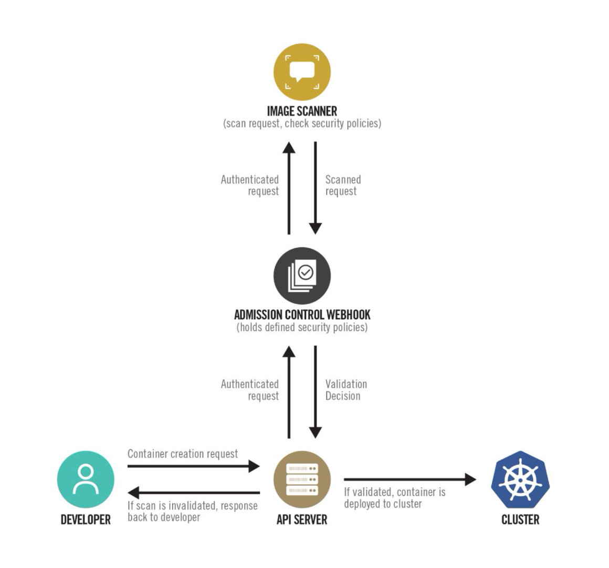

# Kubernetes Pod Security

Pod is the smallest deployable unit in Kubernetes, consisting of one or more containers. Pods are typically the initial execution environment for network actors when leveraging containers. For this reason, Pods should be hardened to make exploitation more difficult and limit the impact of a successful compromise.



## "Non-root" containers and "no-root" container engines

By default, many container services run as the privileged root user, and applications execute as root within the container, although privileged execution is not required.

You can limit the impact of a compromised container by using non-root containers or a rootless container engine to prevent root execution. Both methods can have a significant impact on the runtime environment, so applications should be fully tested to ensure compatibility.

**Non-root containers**: Container Engine allows containers to run applications as non-root users and non-root group members. Typically, this non-default setting is configured when building the container image. **[Appendix A: Example Dockerfile for non-root applications](appendix/a.md)** shows an example Dockerfile that runs an application as a non-root user.

**Non-root user**. Additionally, Kubernetes can load containers into Pods when `SecurityContext:runAsUser` specifies a non-zero user. While the `runAsUser` directive effectively forces non-root execution at deployment time, the NSA and CISA encourage developers to build container applications that execute as a non-root user. Integrating non-root execution at build time provides better assurance that your application will function properly without root privileges.

**Rootless Container Engines**: Some container engines can run in an unprivileged context instead of using a daemon that runs as root. In this case, from the perspective of the containerized application, execution appears to be using the root user, but execution is remapped to the engine user context on the host machine. While rootless container engines add an effective layer of security, many engines are currently released as experimental and should not be used in production environments. Administrators should be aware of this emerging technology and look to adopt rootless container engines when vendors release stable versions that are compatible with Kubernetes.

## Immutable container file system

By default, containers are allowed to execute without restrictions in their own context. A cyber actor who gains execution permissions within a container can create files, download scripts, and modify applications within the container. Kubernetes can lock down a container's file system, preventing many post-exposure activities.

However, these limitations also affect legitimate container applications and can cause crashes or unexpected behavior. To prevent compromise of legitimate applications, Kubernetes administrators can mount a secondary read/write file system for specific directories that applications require write access to. **[Appendix B: Deployment template example for a read-only file system](appendix/b.md)** shows an example of an immutable container with a writable directory.

## Build secure container images

Container images are typically created by building a container from scratch or by building on an existing image pulled from a repository. In addition to using trusted repositories to build containers, image scanning is key to ensuring the security of deployed containers. Throughout the container build workflow, images should be scanned to identify outdated libraries, known vulnerabilities, or misconfigurations such as insecure ports or permissions.



One way to implement image scanning is to use an admission controller. Admission controllers are a native feature of Kubernetes that intercept and handle requests to the Kubernetes API before the object is persisted, but after the request has been authenticated and authorized. A custom or proprietary webhook can be implemented to perform a scan before any image is deployed in the cluster. This admission controller can prevent deployment if the image complies with the organization's security policy defined in the webhook configuration.

## Pod Security Policy

> Pod creation should comply with the principle of least authorization.

The Pod Security Policy (PSP) [^1] is a cluster-wide policy that specifies the security requirements/defaults for Pods to execute within the cluster. While security mechanisms are typically specified in the Pod/Deployment configuration, PSP establishes a minimum security threshold that all Pods must adhere to. Some PSP fields provide default values that are used when a Pod's configuration omits a field. Other PSP fields are used to deny the creation of Pods that do not meet the requirements. PSP is performed through the Kubernetes admission controller, so PSP can only perform requirements during Pod creation. PSP does not affect Pods already running in the cluster.

PSP is useful for enforcing security measures in a cluster. PSP is particularly effective for clusters managed by administrators with hierarchical roles. In these cases, top-level administrators can impose defaults and enforce requirements on lower-level administrators. The NSA and CISA encourage enterprises to adapt the Kubernetes hardened PSP template in [Appendix C: Example Pod Security Policy](appendix/c.md) to their needs. The following table describes some of the widely available PSP components.

**表 1: Pod 安全策略组件**

| 字段名称                                           | 使用方法                                                   | 建议                                                         |
| -------------------------------------------------- | ---------------------------------------------------------- | ------------------------------------------------------------ |
| privileged                                         | 控制 Pod 是否可以运行有特权的容器。                        | 设置为 false。                                               |
| hostPID、hostIPC                                   | 控制容器是否可以共享主机进程命名空间。                     | 设置为 false。                                               |
| hostNetwork                                        | 控制容器是否可以使用主机网络。                             | 设置为 false。                                               |
| allowedHostPaths                                   | 将容器限制在主机文件系统的特定路径上。                     | 使用一个 "假的" 路径名称（比如 `/foo` 标记为只读）。省略这个字段的结果是不对容器进行准入限制。 |
| readOnlyRootFilesystem                             | 需要使用一个只读的根文件系统。                             | 可能时设置为 true。                                          |
| runAsUser, runAsGroup, supplementalGroups, fsGroup | 控制容器应用程序是否能以 root 权限或 root 组成员身份运行。 | - 设置 `runAsUser` 为 `MustRunAsNonRoot`。- 将 `runAsGroup` 设置为非零（参见[附录 C](appendix/c.md) 中的例子：Pod 安全策略示例）。 |
|                                                    |                                                            | 将 `supplementalGroups` 设置为非零（见附录 C 的例子）。将 `fsGroup` 设置为非零（参见[附录 C](appendix/c.md) 中的例子：Pod 安全策略示例）。 |
| allowPrivilegeEscalation                           | 限制升级到 root 权限。                                     | 设置为 false。为了有效地执行 `runAsUser: MustRunAsNonRoot` 设置，需要采取这一措施。 |
| seLinux                                            | 设置容器的 SELinux 上下文。                                | 如果环境支持 SELinux，可以考虑添加 SELinux 标签以进一步加固容器。 |
| AppArmor 注解                                      | 设置容器所使用的 AppArmor 配置文件。                       | 在可能的情况下，通过采用 AppArmor 来限制开发，以加固容器化的应用程序。 |
| seccomp 注解                                       | 设置用于沙盒容器的 seccomp 配置文件。                      | 在可能的情况下，使用 seccomp 审计配置文件来识别运行中的应用程序所需的系统调用；然后启用 seccomp 配置文件来阻止所有其他系统调用。 |

**注意**：由于以下原因，PSP 不会自动适用于整个集群：

- 首先，在应用 PSP 之前，必须为 Kubernetes 准入控制器启用 `PodSecurityPolicy` 插件，这是 `kube-apiserver` 的一部分。
- 第二，策略必须通过 RBAC 授权。管理员应从其集群组织内的每个角色中验证已实施的 PSP 的正确功能。

在有多个 PSP 的环境中，管理员应该谨慎行事，因为 Pod 的创建会遵守**最小限制性**授权策略。以下命令描述了给定命名空间的所有 Pod 安全策略，这可以帮助识别有问题的重叠策略。

```sh
kubectl get psp -n <namespace>
```

## Protect Pod Service Account Token

By default, Kubernetes automatically provides a service account (Service Account) when creating a Pod, and mounts the account's secret token (token) in the Pod at runtime. Many containerized applications do not require direct access to service accounts because Kubernetes orchestration happens transparently in the background. If an application is broken. Account tokens in Pods can be collected by network actors and used to further compromise the cluster. When an application does not require direct access to a service account, Kubernetes administrators should ensure that the Pod specification disables loading secret tokens. This can be done via the `automountServiceAccountToken: false` directive in the Pod's YAML specification.

## Harden container engine

Some platforms and container engines provide additional options to harden containerized environments. A powerful example is using a hypervisor to provide container isolation. The hypervisor relies on hardware to enforce virtualization boundaries, not the operating system. Hypervisor isolation is more secure than traditional container isolation. Container engines running on Windows® operating systems can be configured to use the built-in Windows hypervisor Hyper-V® for enhanced security.

Additionally, some security-focused container engines deploy each container within a lightweight hypervisor to achieve defense in depth. Hypervisor-backed containers can reduce container breaches.


[^1]: Translator's Note: Pod Security Policy has been announced to be deprecated in version 1.21. As a replacement, 1.22 introduced the built-in Pod Security Admission controller and the new Pod Security Standards standard. [Source](https://kubernetes.io/blog/2021/04/06/podsecuritypolicy-deprecation-past-present-and-future/)
